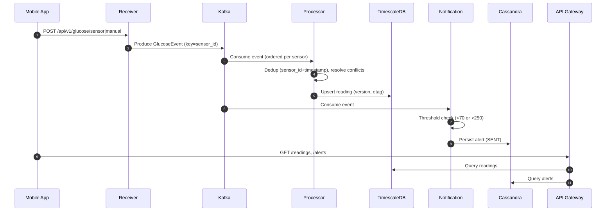

# DexMon Glucose Monitoring Backend – Product-Level Architecture

## Overview
DexMon ingests CGM readings, processes them in real time with Kafka, stores hot data in TimescaleDB, persists alerts in Cassandra, and archives cold data to S3 for analytics.

## High-Level Architecture
(Diagram source: `docs/diagrams/architecture.mmd`)
```mermaid
flowchart LR
  M[Mobile App] -->|REST /api/v1/glucose| R[Glucose Receiver]
  R -->|produce| K[(Kafka\n(glucose.events))]
  K --> P[Glucose Processor]
  K --> N[Notification Service]
  P --> T[(TimescaleDB)]
  N --> C[(Cassandra)]
  A[Data Archival] -->|read >90d| T
  A -->|Parquet| S3[(S3)]
  G[API Gateway] -->|query readings| T
  G -->|query alerts| C
  P -.DLQ.-> KDLQ[(glucose.events.dlq)]
  N -.DLQ.-> ADLQ[(glucose.events.alerts.dlq)]
```

## Sequence (Ingestion → Alerting → Query)


## Data Stores
- TimescaleDB: table `glucose_readings(id, sensor_id, user_id, timestamp, glucose_value, source, version, etag, created_at, updated_at)`; hypertable on `timestamp`; unique `(sensor_id, timestamp)`.
- Cassandra: table `glucose_alerts(user_id, timestamp, alert_id, glucose_value, alert_type, status)` partitioned by `user_id`.
- S3: Parquet archives partitioned by date and/or user.

## Reliability & Semantics
- Producer: idempotent (`enable.idempotence=true`, `acks=all`) and key by `sensor_id` for ordering.
- Consumer: retries with DLQ; DB dedup enforces effectively-once writes.

## Conflict Resolution
- SENSOR outweighs MANUAL at same `(sensor_id, timestamp)`; bump `version`, recompute `etag`.

## Security & Observability
- OAuth2/JWT (dev override: `security.disabled=true`).
- Prometheus metrics via Actuator; Grafana dashboards.

## Deployment
- Local: docker-compose (Kafka, TimescaleDB, Cassandra, Prometheus, Grafana).
- K8s: manifests in `k8s/` (namespace `dexmon`).
- CI: GitHub Actions builds/tests.
